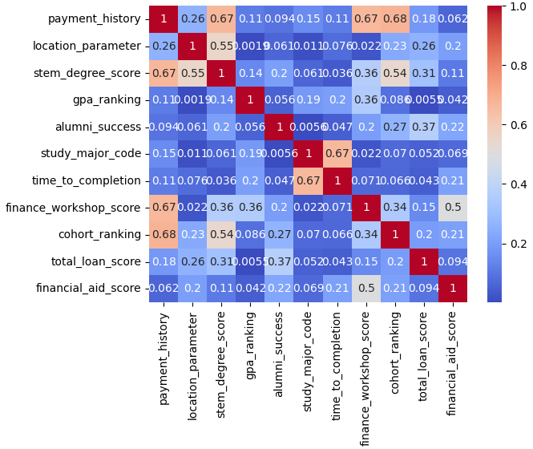
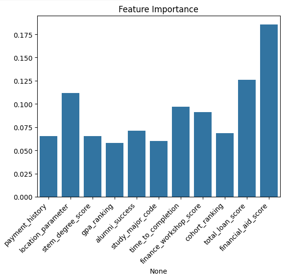
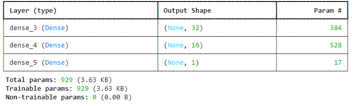
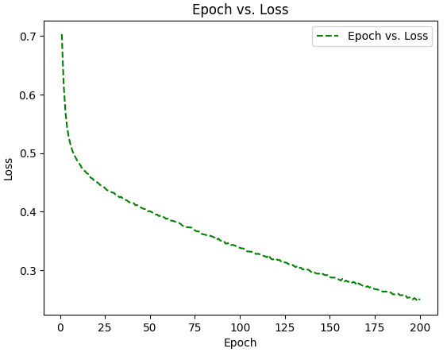
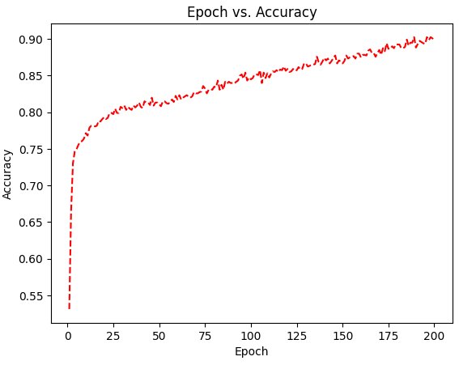
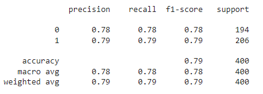
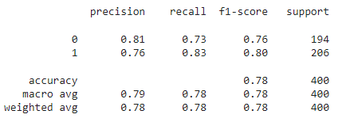

# neural-network-challenge-1

student_loans_with_deep_learning.ipynb

https://drive.google.com/file/d/1F00wHiB5Z-yKe9VgMsYJG2RPmye7kbak/view?usp=drive_link

student_loans_with_deep_learning_performance_reduce.ipynb

https://drive.google.com/file/d/1tdKl2_3Qdd7w7-3ZlJcW9U48dkxYFB2Z/view?usp=drive_link

### Background

This project is to utilize data to determine risk in offering student loan refinancing using TensorFlow Neural Network Modeling.

The Source data is a CSV file with information about previous student loan recipients with information about these students, such as their credit ranking.

The goal is to create a create a model to predict student loan repayment.

* Prepare the data for use on a neural network model.
* Compile and evaluate a model using a neural network.
* Predict loan repayment success by using your neural network model.
* Discuss creating a recommendation system for student loans

#### Details

Created a deep neural network using Tensorflow's Keras model.

Setting y/target dataset: “credit_ranking” column.

Split and scale X data.  The features used in this model include:
'payment_history', 'location_parameter', 'stem_degree_score',
'gpa_ranking', 'alumni_success', 'study_major_code', 'time_to_completion',
'finance_workshop_score', 'cohort_ranking', 'total_loan_score', 'financial_aid_score'

* Review X/feature data for highly correlated data (corr() function, seaborn heatmap, pyplot))



* Review X/Feature data for Feature Importance (RandomForestClassifier, seaborn):




**Defined, create and compile the Neural Network model.**  

Used a two-layer deep neural network model (Keras Sequential Dense model) that uses the `relu` activation function for both layers:


```
import tensorflow as tf

feature_count = len(X.columns)
hidden_nodes_layer_1 = 32 #perform up from 10
hidden_nodes_layer_2 = 16 #perform up from 5
neurons_output_layer = 1

nn_model = Sequential()

nn_model.add(Dense(units=hidden_nodes_layer_1, activation="relu", input_dim = feature_count))
nn_model.add(Dense(units=hidden_nodes_layer_2, activation="relu"))
nn_model.add(tf.keras.layers.Dense(units=1, activation="sigmoid"))

nn_model.summary()
```



```
nn_model.compile(loss="binary_crossentropy", optimizer="adam", metrics=["accuracy"])
fit_model = nn_model.fit(X_train_scaled, y_train, epochs=200)

```

13/13 - 0s - 14ms/step - accuracy: 0.7600 - loss: 0.6178
Loss: 0.6177812814712524, Accuracy: 0.7599999904632568





* Predictions on the testing data were saved to a DataFrame and rounded to binary values.
* Reviewed model summary and inspect the structure; evaluated the model to calculate its loss and accuracy (data below).

#### Libraries Utilized

* Pandas
* Tensorflow
* Keras, Dense and Sequential models
* sklearn model_selection preprocessing (train_test_split)
* sklearn preprocessing StandardScaler for scaling data
* sklearn metrics classification_report
* numpy, seaborn, matplotlib.pyplot to visualize Correlated Data
* sklearn.ensemble RandomForestClassifier and seaborn to determine Feature Importance
* matplotlib.pyplot for additional visualizations

## Predict Loan Repayment Success

Generated a classification report with the predictions and testing data.

Made predictions using reserved testing data.

#### Results 1: student_loans_with_deep_learning.ipynb:



**Description of model:**
student_loans_with_deep_learning_reduced.ipynb
increased neuons of 1st and 2nd layers to 32/16
Epochs = 200, which appeared to be plateau for Accuracy/Loss

**Evaluation of model:**

The model performs well overall.  Overall accuracy of 79%
Model performs similarly for both classes, with slightly better recall for class 1.
Model is well-balanced (194 instances of Class 0, 206 instances of Class 1)
and performs consistently across both classes

NOTE: class 0 : bad credit risk; class 1: good credit risk

**Details:**
Precision (predicted true results were actually true)
    Class 0: 78% of the instances predicted as class 0 are actually class 0.
    Class 1: 79%

Recall/Sensitivity (actually true data points were identified correctly):
    Class 0: model correctly identifies 78% of the actual class instances
    Class 1: 79%


#### Results 2: student_loans_with_deep_learning_performance_reduce.ipynb:

A second model was created to attempt to both improve performance and reduce the Feature columns (see student_loans_with_deep_learning_performance_reduce.ipynb).

Features were reduced to excluding columns that are suspected to be unrelated to the target/outcome (location_parameter, alumni_success, study_major_code), as well as a column that could be causing data leakage (predictive of the outcome)(financial_aid_score).  The number of features was reduced to 7



**Description of model:**

For this model, I performed feature reduction, removing perceived unrelated columns and a column suspected of providing a data leak.  

Epochs of 25 appeared to be plateau for Accuracy/Loss (see seaborn charts in ipynb)

**Evaluation of model:**

The model performs well with overall accuracy of 78%.
Model performs similarly for both classes, with slightly better recall for class 1.
Model is well-balanced ()194 instances of Class 0, 206 instances of Class 1) and performs consistently across both classes.

Training accuracy was 0.9220 (model correctly predicts the training data with an accuracy of 92.20%), as seen in output in final Epoch of the Train/Fit of the model:
Epoch 100/100
38/38 ━━━━━━━━━━━━━━━━━━━━ 0s 2ms/step - accuracy: 0.8690 - loss: 0.3418

*NOTE: class 0 : bad credit risk; class 1: good credit risk*

**Details:**
**Precision** (predicted true results were actually true)

* Class 0: 81% of the instances predicted as class 0 are actually class 0.
* Class 1: 76%

**Recall/Sensitivity** (actually true data points were identified correctly):

* Class 0: model correctly identifies 73% of the actual class 1 instances
* Class 1: model correctly identifies 83% of the actual class 1 instances


## Recommendation System for Student Loans

1. Describe the data that you would need to collect to build a recommendation system to recommend student loan options for students

* The features used in this model include:
  'payment_history', 'location_parameter', 'stem_degree_score',
  'gpa_ranking', 'alumni_success', 'study_major_code', 'time_to_completion',
  'finance_workshop_score', 'cohort_ranking', 'total_loan_score', 'financial_aid_score'
* From each candidate/student, would need their history of payments (of other loans), their address/location, their grades, ranking, major, time to complete their major, scores from the finance workshop, ranking in their cohort, financial aid scores (from the university?) and total loan score for any other loans taken.

2. Based on the data you chose to use in this recommendation system, would your model be using collaborative filtering, content-based filtering, or context-based filtering? Justify why the data you selected would be suitable for your choice of filtering method.

* Content-based filtering leverages the attributes of each candidate to make recommendations.  We have this data: grades, major, financial score.
* Context-based filtering considers the context in which the recommendation is made.  We have data such as location and history of payments.
* Collaborative filtering is based on user interactions or preferences; we don't have that data available.
* The recommendation model would be a hybrid of content and context-based filtering.  Content-based can help build a profile; context-based filtering- can be used to customize recommendations based on the user's context.

2. Describe two real-world challenges that you would take into consideration while building a recommendation system for student loans. Explain why these challenges would be of concern for a student loan recommendation system.

* Most of this data is highly sensitive: financial, grades, location, etc.  Use of the data would require consent and would have to be handled/maintained  carefully.
* Financial aid applications might contain information about race/gender, which would be sensitive information to use to determine if a loan will be granted.  Using attribues like race/gender, and even major and financial aid might insert biases into the recommendation engine.


---
