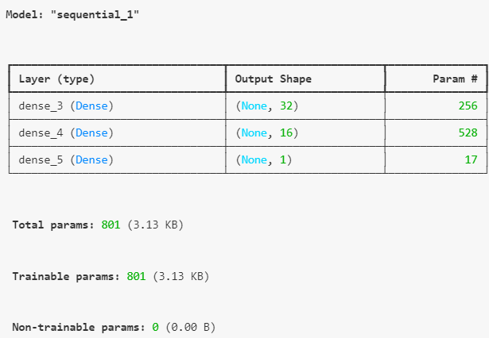

# Student Loan Repayment Prediction with Deep Learning Model

This project aims to predict student loan repayment success using a deep neural network model built with TensorFlow's Keras library. Enhanced preprocessing, feature selection using Random Forest were applied to improve the model's performance. The dataset contains information on previous student loan recipients, including various academic, financial, and demographic factors.

**[Project Workflow](#project-workflow)** | **[Modeling](#modeling)** | **[Interpretation and Insights](#interpretation-and-insights)** | **[Follow-On Studies](#follow-on-studies)**

---

## Abstract

This project involves building a deep neural network to predict student loan repayment success based on data from previous student loan recipients. The steps include extensive data preprocessing, feature selection, building and evaluating a deep learning model, and analyzing feature importance. The goal is to enhance prediction accuracy and provide actionable insights for loan approval decision-making.

---

## Core Technologies, Tools

Deep Learning, Neural Networks, Data Preprocessing, Feature Selection, Predictive Modeling, Data Visualization.

* **Languages/Tools:** Python, Jupyter Notebook, Google Colab
* **Data Pre-Processing**: Pandas for data manipulation and cleaning; Scikit-learn `train_test_split` for splitting data into training and testing sets; Scikit-learn `StandardScaler` for scaling data before training
* **Model Building and Training:** TensorFlow and Keras (Sequential, Dense layers) for building and training the deep neural network
* **Evaluation and Performance:** Scikit-learn `classification_report` for evaluating model performance using accuracy, precision, recall, and F1 scores
* **Feature Selection, Importance, and Data Reduction:** Scikit-learn `RandomForestClassifier` and Seaborn for determining feature importance
* **Data Visualization: NumPy,** Seaborn, and Matplotlib for visualizing correlations and other insights

---

## Project Workflow

#### **Data Collection**

* Loaded the dataset from an external CSV file containing student loan recipient information with features such as payment history, GPA ranking, time to completion, financial aid score, etc.

#### **Feature Transformation**

* **Scaling Features** : `StandardScaler` applied to normalize the features, improving model convergence and training stability.
* **Encoding** : Converted the target column, `credit_ranking`, into a format compatible with the deep learning model.

#### **Exploratory Data Analysis (EDA)**

For the model, I performed feature reduction, removing perceived unrelated columns and a column suspected of providing a data leak.

* ****Feature Importance Visualization** :** Used Random Forest classifier feature importance attribute and Seaborn to create a bar plot showcasing the importance of various features **(fig 1).**
* **Correlation Analysis** : Visualized feature correlations by calculating correlation matrix and using a heatmap to identify highly correlated variables and remove redundant features **(fig 2).**
* Additional features were dropped due to irrelevance and possible source of data leakage.

<figure>
    <figcaption><em>fig 1.</em></figcaption>
    
</figure>

<figure>
    <figcaption><em>fig 2.</em></figcaption>
    
</figure>

---

## Modeling

#### **Model Selection**

* **Deep Neural Network (DNN)** : Created deep learning model using TensorFlow's Keras API to predict student loan repayment success.
* **Neural Network Setup** :
* Created `Sequential` model with multiple dense layers, using `relu` activation function for the first two hidden layers. Included dropout to prevent overfitting.  Compiled and fit Keras Sequential model with `binary_crossentropy` loss function, the `adam` optimizer, and the `accuracy` evaluation metric.

<figure>
    <figcaption><em>fig 3.</em></figcaption>
    
</figure>

#### **Hyperparameter Tuning**

* Tuned parameters such as the number of layers, to enhance model accuracy and reduce overfitting.
* Created DataFrame of the model_fit_history in order to plot elbow curve of **Epochs vs Loss** and **Epochs vs. Accuracy** to determine optimal Epochs for training.  Epochs of 25 appeared to be plateau for Accuracy/Loss (see seaborn charts in ipynb)

<figure>
    <figcaption><em>fig 4.</em></figcaption>
    
</figure>

<figure>
    <figcaption><em>fig 5.</em></figcaption>
    
</figure>

#### **Evaluation and Scoring***.*

**Evaluation Metrics** : Accuracy, Precision, Recall, and F1 score were used to assess model performance on the test dataset.

<figure>
    <figcaption><em>fig 6.</em></figcaption>
    
</figure

The model performs well with overall accuracy of 78%.
Model performs similarly for both classes, with slightly better recall for class 1.
Model is well-balanced ()194 instances of Class 0, 206 instances of Class 1) and performs consistently across both classes.

Training accuracy was 0.9220 (model correctly predicts the training data with an accuracy of 92.20%), as seen in output in final Epoch of the Train/Fit of the model:
Epoch 100/100
38/38 ━━━━━━━━━━━━━━━━━━━━ 0s 2ms/step - accuracy: 0.8690 - loss: 0.3418

---

## Interpretation and Insights

* **Feature Importance** : The feature `payment_history` was found to be the most influential in predicting loan repayment success, along with `financial_aid_score` and `gpa_ranking`.
* **Model Performance** : The model performs well with overall accuracy of 78%.

Model performs similarly for both classes, with slightly better recall for class 1.
Model is well-balanced 194 instances of Class 0, 206 instances of Class 1) and performs consistently across both classes.

**Details:**
**Precision** (predicted true results were actually true)

* Class 0: 81% of the instances predicted as class 0 are actually class 0.
* Class 1: 76% of the instances predicted as class 1 are actually class 1.

**Recall/Sensitivity** (actually true data points were identified correctly):

* Class 0: model correctly identifies 73% of the actual class 1 instances
* Class 1: model correctly identifies 83% of the actual class 1 instances

NOTE: class 0 : high-risk credit risk; class 1: low-risk credit risk

---

## Follow-On Studies

*Suggested future data processing, modeling, and investigations.*

* Perform additional hyperparameter optimization using methods like Grid Search or Bayesian Optimization.
* Incorporate macroeconomic indicators (e.g., unemployment rate, inflation) to improve the robustness of the model.
* Explore alternative machine learning models such as Gradient Boosting or XGBoost for comparison.
